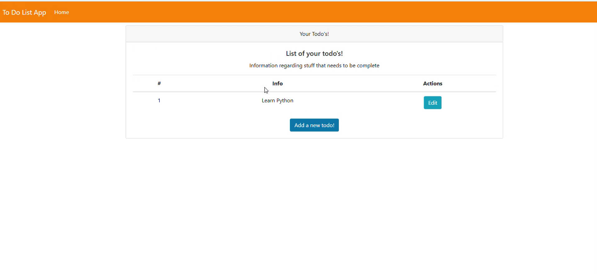

# FastAPI Gemini To-Do App

A to-do application built with FastAPI that integrates Google Gemini 1.5 Pro for task descriptions. Users can register, create tasks, and get AI-generated descriptions using Gemini. The app is containerized with Docker and deployed on Google Cloud.

## Demo Video

[](https://youtu.be/3zZTFchu9Ic)


## Features

- **User Authentication**: Register and log in securely.
- **To-Do Management**:
  - Add tasks with a title, priority, and prompt for Gemini.
  - Automatically generate task descriptions using Gemini 1.5 Pro.
  - Edit tasks to view AI-generated descriptions.
- **Frontend**: Uses HTML templates, CSS, and JavaScript for UI.
- **Database**: Uses SQLite with SQLAlchemy ORM.
- **Deployment**: Containerized with Docker and deployed on Google Cloud via SSH.

## Installation

### Prerequisites
- Python 3.10+
- Docker & Docker Compose
- FastAPI & SQLAlchemy
- Google Cloud (for deployment)

### Setup
1. Clone the repository:
   ```sh
   git clone https://github.com/FatimeNazliAs/gemini-to-do-app.git
   cd gemini-to-do-app
   ```
2. Create a virtual environment:
   ```sh
   python -m venv venv
   source venv/bin/activate  # On Windows: venv\Scripts\activate
   ```
3. Install dependencies:
   ```sh
   pip install -r requirements.txt
   ```
4. Set up the database:
   ```sh
   alembic upgrade head
   ```
5. Run the app:
   ```sh
   uvicorn main:app --reload
   ```

## Docker Deployment

1. Build the Docker image:
   ```sh
   docker build -t gemini-to-do-app .
   ```
2. Run the app with Docker Compose:
   ```sh
   docker-compose up -d
   ```

## API Endpoints

| Method | Endpoint               | Description                                     |
|--------|------------------------|-------------------------------------------------|
| POST   | /auth/                  | Register a new user                            |
| POST   | /auth/token             | User login and retrieve an access token        |
| GET    | /auth/login-page        | Render the login page                          |
| GET    | /auth/register-page     | Render the registration page                   |
| GET    | /to_do/todo-page        | Get the To-Do list page for the authenticated user |
| GET    | /to_do/edit-todo-page/{to_do_id} | Edit a specific To-Do item by ID      |
| GET    | /to_do/add-todo-page    | Render the page to add a new To-Do item        |
| GET    | /to_do/read_all         | Get all To-Do items for the authenticated user |
| GET    | /to_do/to_do/{to_do_id} | Get a specific To-Do item by ID                |
| POST   | /to_do/to_do            | Create a new To-Do item                        |
| PUT    | /to_do/to_do/{to_do_id} | Update an existing To-Do item by ID            |
| DELETE | /to_do/to_do/{to_do_id} | Delete a specific To-Do item by ID             |


## Deployment on Google Cloud

1. Connect to your Google Cloud instance via SSH:
   ```sh
   gcloud compute ssh your-instance-name --project your-project-id --zone your-zone
   ```
2. Clone the repository and navigate to it.
3. Build and run the Docker container:
   ```sh
   docker-compose up -d
   ```
4. Configure firewall rules to allow external access to the FastAPI app.

## Future Enhancements
- Add user-specific task filtering
- Implement JWT authentication for better security
- Enhance UI with a more interactive frontend framework

## License
This project is licensed under the MIT License.


